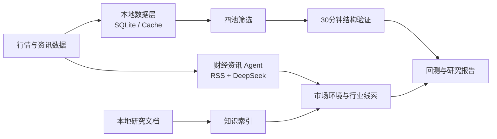

# AI Quant Research System

面向 A 股主板研究的本地 AI Agent 与量化分析项目。项目把行情数据、四池筛选、30 分钟执行验证、历史回测、本地知识索引和财经资讯摘要整合为一条可复用的研究流水线。

> 本项目仅用于学习、研究和技术展示，不构成投资建议，也不承诺任何收益。

## 核心能力

- **行情数据层**：Baostock、东方财富/efinance 等数据源，SQLite 保存日线与 30 分钟数据。
- **四池筛选**：趋势预备池、B1 回踩池、B2 回踩池、起爆确认池。
- **回测与执行**：日线负责候选资格，30 分钟结构负责执行验证，自动输出 JSON/Markdown 报告。
- **本地知识库**：解析 Markdown、TXT、DOCX、PDF，按技术形态、资金主线、题材产业、基本面和风险纪律建立索引。
- **财经资讯 Agent**：整合 [FinNewsCollectionBot](https://github.com/sgrsun3/FinNewsCollectionBot) 的 RSS 抓取、DeepSeek 摘要和 ServerChan 推送能力。

## 系统架构



资讯与外部研究资料只用于市场环境、风险温度和行业线索，不直接产生买点。最终候选仍需经过四池规则、30 分钟结构与风险纪律验证。

## 项目结构

```text
.
├─ src/
│  ├─ market_data_store.py          # SQLite 行情库
│  ├─ light_daily_screener.py       # 四池筛选
│  ├─ backtest_formulas.py          # 筛选与回测公式
│  ├─ backtest_30m_execution.py     # 30分钟执行验证
│  ├─ daily_backtest_runner.py      # 每日回测入口
│  ├─ lightweight_bbi_backtester.py # 轻量 BBI 回测
│  ├─ build_local_knowledge_index.py# 本地文档知识索引
│  ├─ ingest_trading_articles.py    # 研究资料接入
│  └─ kb_memory_bridge.py           # 知识库联动快照
├─ news_agent/
│  └─ financebot.py                 # RSS + DeepSeek + ServerChan
├─ docs/
├─ tests/
└─ .github/workflows/news-brief.yml
```

## 快速开始

### 1. 安装依赖

```bash
python -m venv .venv
pip install -r requirements.txt
```

### 2. 运行四池筛选

```bash
python src/light_daily_screener.py
```

### 3. 运行日线与 30 分钟回测

```bash
python src/daily_backtest_runner.py --lookback-days 60
```

### 4. 建立本地知识索引

将本人有权使用的研究资料放入 `knowledge_sources/`，然后运行：

```bash
python src/build_local_knowledge_index.py
python src/ingest_trading_articles.py
```

也可以通过环境变量指定外部资料目录：

```bash
AQRS_EXTERNAL_NOTES=/path/to/notes python src/build_local_knowledge_index.py
```

### 5. 运行财经资讯 Agent

复制 `.env.example` 中的变量到本机环境或 GitHub Actions Secrets：

```bash
python news_agent/financebot.py
```

未配置 `SERVER_CHAN_KEYS` 时，报告只输出到控制台；API Key 不应写入代码或提交到仓库。

## 交易研究框架

四池的职责严格分离：

1. **趋势预备池**：建立趋势底池，只观察，不直接视为买点。
2. **B1 回踩池**：关注 34 日线附近的中级回踩。
3. **B2 回踩池**：关注 13 日线附近的短节奏回踩确认。
4. **起爆确认池**：寻找趋势内突破昨日高点、位置和量能仍可控的候选。

进入任何池子都不代表交易触发。详细方法见 [docs/strategy.md](docs/strategy.md)。

## 数据与版权边界

- 仓库不包含个人交易记录、API Key、本地数据库、付费文章或原始课程资料。
- 本地知识索引只处理使用者自行提供且有权使用的文件。
- RSS 新闻的版权归原发布者所有；项目只保存标题、链接和用于摘要的临时正文。

## 验证

```bash
python -m compileall src news_agent tests
python -m unittest discover -s tests -v
```

## License

MIT License。详见 [LICENSE](LICENSE)。
